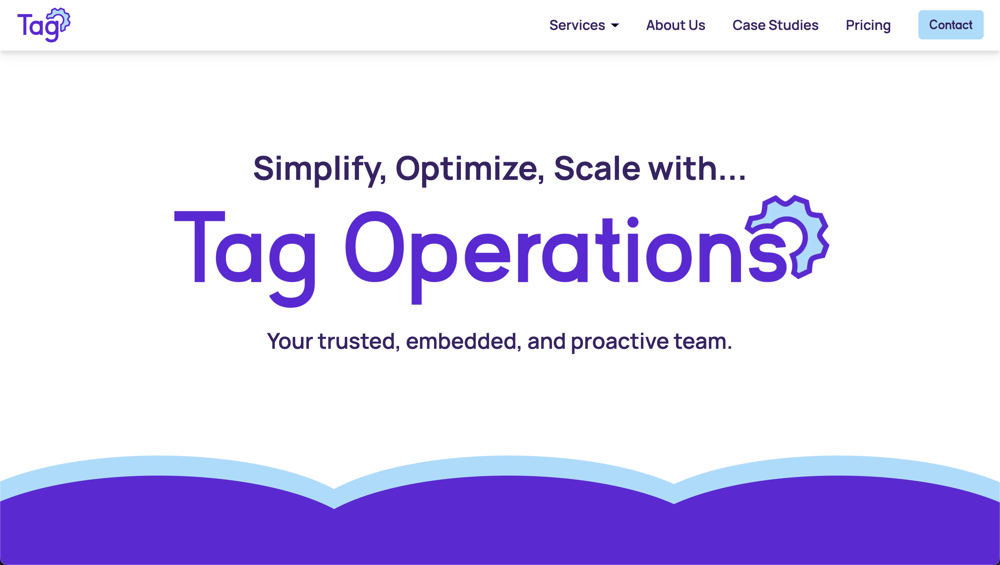

<div align='center'>
    
</div>

<br>

<p >
  The third version of <a href='https://www.tagoperations.com/' target='_blank'>tagoperations.com</a> built with <a href='https://nextjs.org/' target='_blank'>Next.js</a>, designed and developed by <a href='https://github.com/hicass'>Cass Walters</a>.
</p>

<p>
    Tag Ops is a dynamic operational support company that offers a versatile range of services to businesses of all sizes. With a client-centric approach, Tag Ops simplifies intricate operational processes, optimizes resources, and enhances efficiency. This enables businesses to focus on growth and innovation while Tag Ops manages the operational backbone. With a commitment to flexibility and innovation, Tag Ops crafts tailored solutions to meet the diverse needs of its clients, ensuring sustainable success in today's competitive landscape.
</p>

<div align='center'>
    
</div>

<br>
<br>
<br>

# Tech Stack

**Client:**

- [Next.js](https://nextjs.org/)
- [Tailwind.css](https://tailwindcss.com/)
- [Framer Motion](https://www.framer.com/motion/)
- [Email.JS](https://www.emailjs.com/)

**Deployment:**

- [Vercel](https://vercel.com/)

## Setup and Installation

1. **Clone the repository:**

   ```bash
   git clone https://github.com/yourusername/tagoperations.com-v3.git

   ```

2. **Install dependencies:**

   ```bash
   npm install

   ```

3. \***\*Run the development server:**

   ```bash
   npm run dev
   ```

4. Open [http://localhost:3000](http://localhost:3000) in your browser to see the application.

<br>
<br>
<br>

# Style Guide

## Color Reference

| Color           | Hex                                                              |
| --------------- | ---------------------------------------------------------------- |
| Text            |  #392365 |
| Primary         |  #6126d8 |
| Secondary       |  #d0b2ff |
| Secondary Light |  #e7d8ff |
| Accent          |  #a3ddff |
| Accent Light    |  #d4efff |
| Background      |  #ffffff |
